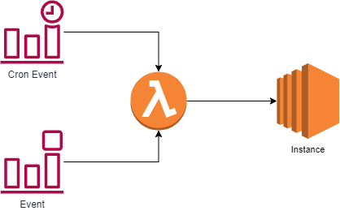

# AWSLongRunningTask

## The problem
Sometimes you need to run a automated task that cannot be run in an AWS Lambda function. For example, you may need to synchronize data between two systems and that may take longer than the max 15 minutes lambda functions can run today or you may need to use applications that cannot be run in AWS Lambda. To get around the timeout there are multiple possible solutions. 
1. Break the work that needs to be done into chunks and have the function run one chunk of the work at a time
1. Have the lambda function keep track of the time and once it gets close to the timeout have it make note of where it left off and invoke itself again to keep working in the next run.
1. Use a different service/product such as ECS

## Pros and Cons of the solutions above
1. The first solution above has the pro of it all running in an AWS Lambda function but the con of having to break work up into chunks. Sometimes this is easy. Such as if you are paging through results and processing them, you can have the the function invoke itself with the next page of results it needs to process. A problem is this can add complexity as you need to make a recursive function and/or your use case does not easily use
1. The second solution above has the pro of you do not have to chunkify the task. The con is that you need to keep track of time. This adds lots of complexity.

## A Different Solution
We are going to go with option 3 which is to go with a different solution. The solution is to use AWS Lambda still but just to launch an EC2 Instance. The EC2 Instance can run for an unlimited amount of time and it can also run whatever applications are needed.

## The Actual Solution



This solution works by having some sort of trigger invoking a lambda function and passing parameters. In the example above this is done with CloudWatch/EventBridge Rules. But you can have anything that can trigger a Lambda Function. This lambda function is very simple. All it does is launches an EC2 and provides it the userdata script it needs to run. Below is an example of a lambda function that does this.

```
import json
import boto3

def lambda_handler(event, context):
    
    script = ""
    scriptFile = open("./script.sh", "r")
    for line in scriptFile:
        script += line
    scriptFile.close()
        
    client = boto3.client("ec2")
    resp = client.run_instances(ImageId="ami-12345678912345678", InstanceType="t3a.nano", IamInstanceProfile={"Arn": "arn:aws:iam::123456789123:instance-profile/MyIAMRole"}, InstanceInitiatedShutdownBehavior="terminate", MaxCount=1, MinCount=1, UserData=script, SubnetId="subnet-12345678")
    print(resp)
```

The code above does 2 things. One is that it reads a script file packaged up with the lambda function that script is below. The reason we read the script into a string is we need to pass it to the EC2 Instance through the userdata parameter. The second part of the script launches an EC2 Instance. In the example code above I am using a t3a.nano instance type since it is currently the cheapest x86 based instance type. But you can change this to whatever you need it to be.

```
#!/bin/bash
sudo su -
yum update -y
yum groupinstall 'Development Tools' -y
git clone https://example.com/myrepo
cd myrepo
make
date=$(date '+%Y/%m/%d/%H/%M/%S')
aws s3 cp ./bin/app s3://example-builds/$date/
aws s3 cp /var/log/cloud-init-output.log s3://example-logging-bucket/$date/
shutdown now

```

You are probably asking a good question right now. If this creates an EC2 Instance how do the EC2 Instances get cleaned up once they finish their task? The last line of the script turns the server off but doesn't that just mean the server will remain in the account costing money? They key to this entire solution is the parameter to the run_instances function in the lambda function called "InstanceInitiatedShutdownBehavior". The default for this parameter if not set is "stop". This means the instance when shutdown will go into a stopped state which means it will will be off but the EBS volumes and other resources will still exist and you will be billed for them. The reason the code above sets the value to "terminate" is because if you shutdown the server and have that parameter set to terminate the server will terminate itself once it reaches the stopped state. This cleans up the resources such as EBS volumes and IP addresses.

So what does the example script above do. This script was used on an Amazon Linux 2 based EC2 Instance. 
First it logs in as root just so we don't have to worry about permissions. It then installs any updates that are needed. It then installs some software we need such as the "development tools". It then clones down a git repo. It then runs "make" to compile the code. Compiling a large project might be very hard to do on AWS Lambda itself especially if it takes a very long time to run. The next few lines build a string of the current date/time and upload the result of our build along with a copy of the logs so if there is an issue we can debug what happened. It then runs the key to this solution which is the "shutdown now" command to have the server shutdown. **Note: The new line after the shutdown command is very important. If you do not have it the "shutdown now" command will be into the shell but not executed**

## Permissions Required
- The EC2 Instance Does not need an IAM Role and/or one with Any Permissions. I recommend giving it access to write logs from the system to S3 or CloudWatch etc. It might need permissions to something like CodeCommit or something like that.
- The AWS Lambda function needs a few permissions. Those are below.
```
...
    {
        "Effect": "Allow",
        "Action": [
            "iam:PassRole",
            "ec2:DescribeInstances",
            "ec2:RunInstances",
            "ec2:AssociateAddress"
        ],
        "Resource": "*"
    }
...
```


## Other notable things to mention
- If you do want to use this method you will want to make sure the EC2 Instance is put into a subnet where it has access to the resources it needs. I recommend giving it a Security Group with no inbound permitted. 
- Authentication can get complicated. I do not recommend hard coding credentials into your script and/or into the Lambda function. I recommend granting the EC2 Instance access to something like AWS Secrets Manager to fetch credentials. 
- If your script(s) cannot fit inside the userdata, I recommend using S3 to store your scripts and have the EC2 pull the scripts down.
- Remember this EC2 Instance will be running in one of your VPC so you will need to make sure the instance has the ability to talk to the resources it needs access to. For example, if it needs to talk with other servers on the network you will likely need to update Firewalls/Security Groups/NACLs/etc. Depending on your use case your instance may need a route out to the internet. I recommend putting the instance in a private subnet and having it talk out to the internet through a NAT Gateway or a firewall.